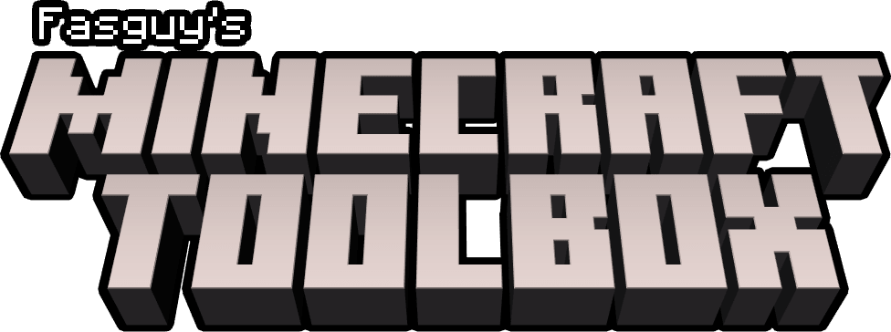

# Minecraft Toolbox

	

## Information

Minecraft Toolbox is a WebApp that provides multiple tools to alter your Minecraft gameplay experience.

## Tools

* Loot-Table Randomizer
\
Randomizes the drops of blocks, entities and events, as well as generated chest contents.
* Crafting-Recipe Randomizer
\
Randomizes the crafting recipes of items.

## Use

If you just want to use the Toolbox, you can check out a live version at https://fasguy.net/minecraft_toolbox.

## Branches

The versions in the branches of this repository are not considered `stable`.
\
If you're looking for a specific version of the Minecraft Toolbox, then [check the tags](https://github.com/Fasguy/MinecraftToolbox/tags)